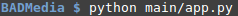

# BADMedia

## Overview

  BADMedia is a project that can generate webpages customized specifically to a user's interests. Unlike social media, which relies on the cooperation of the producers of the media and confines the consumption of media to their application, BADMedia can aggregate media of any format to be consumed either directly through the webpage or downloaded to be consumed later.

  This is made possible through XML/RSS feeds (you know, those things typically used as nothing more than background noise on ad-invested news blogs?) Most prominent producers of media have these, and all a user need do is enter it into the BADMedia program to keep themselves updated on the producer through an encapsulated section of their webpage.

  This is by far the least constrained way to keep a user up-to-date on whatever interests them most and can supply media that interests them. If the user is ever going on a flight or knows they will not be able to access the internet for some time, they are no longer restricted to whatever entertainment they would otherwise be subjected to without the help of BADMedia. This is because every unit of media on a BADMedia page can be downloaded at the click of a button. (Except youtube videos)

___
## Setting up webpage

Run the main Python script:




Answer questions per media source


___
## How it works

  The main Python file takes input from the user to convert the relevant content of a given RSS feed into a JSON object, which is added to a list of all the user's media. Then, an HTML file is dynamically generated to convert the JSON objects into encapsulated sections of the BADMedia page.

  ```javascript
  {
    "name": "title given by user",
    "type": "audio, video, text, image or youtube",
    "tag": "tag that encloses media in XML file",
    "xml": "link to xml file",
    "media": {
      "1": "url",
      "2": "url",
      "3": "url"
    }
  }
  ```
  This is the format of a feeds corresponding json object. the "media" key can hold any number of URLs.
___
